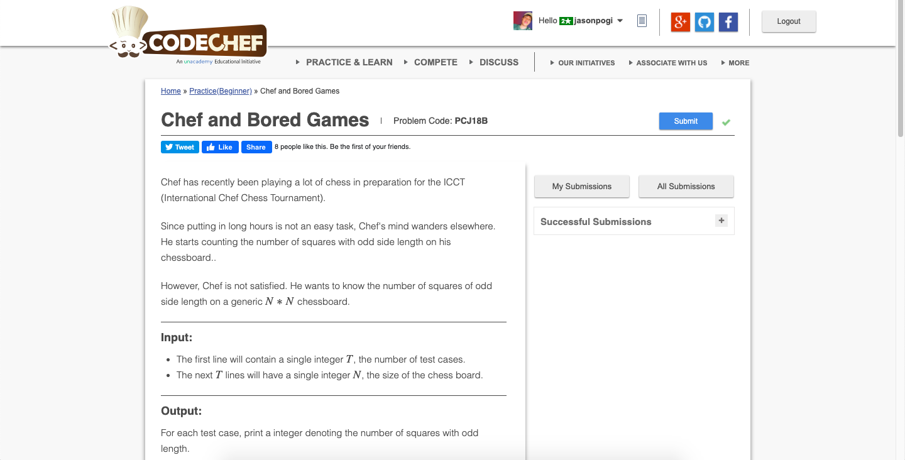

# Codechef-Chef-and-Bored-Games
### Problem

### Program Simulation
<pre>
  Sample Input: 3
  
  n = 3
  ans = 0
  
  * First Loop *
    ans += 3 * 3 
    ans = 9
    n -= 2
    n = 1
  
  * Second Loop *
    ans += 1 * 1
    ans = 10
    n -= 2
    n = -1
    
  print ans
  
  Final Output:
  10
  

  Sample Input: 10
  
  n = 10
  ans = 0
  
  * First Loop *
    ans += 8 * 8
    ans = 64
    n -= 2
    n = 6
  
  * Second Loop *
    ans += 6 * 6
    ans = 100
    n -= 2
    n = 4
  
  * Third Loop *
    ans += 4 * 4
    ans = 116
    n -= 2
    n = 2
  
  * Fourth Loop *
    ans += 2 * 2
    ans = 120
    n -= 2
    n = 0
  
  print ans
  
  Final Output:
  120
</pre>
